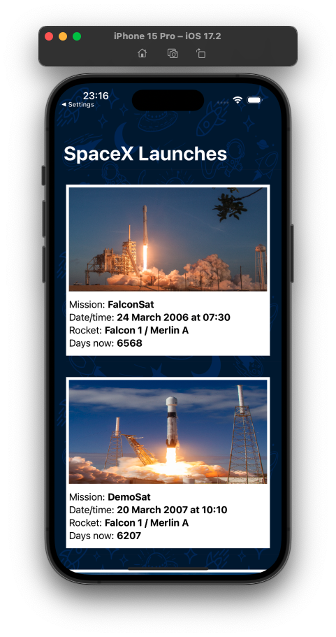
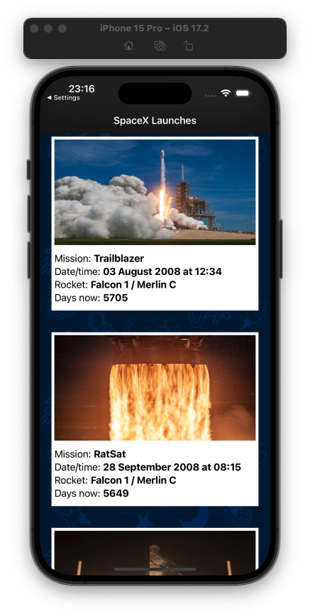

# SpaceX API App

 

- **Application language:** English
- **Code language:** English

___


## About:
A very simple SpaceX app that was build to provide information about SpaceX launches and rockets using [SpaceX API](https://documenter.getpostman.com/view/2025350/RWaEzAiG?version=latest). I build the app using Storyboard because it's just a proof-of-concept and, for that, it's faster. I chose MVVM due to the separation of concerns between the components that the architecture provides, making it easier to test, for example: The ViewModel is responsible for containing the presentation logic and screen state, while the View is only responsible for displaying this data and responding to user events. This makes it easier to test the ViewModel in isolation. For third-party library I used Alamofire to simplify the process of performing network operations and handling server responses. The application is crafted with simplicity and user-friendliness in mind.

## Screenshots
 

## Main Features:
- List of SpaceX launchs using UITableView
- Details about the mission 
- Images of the rockets used


## Technologies:
- `Swift 5`
- `Xcode 15.2`
- `iOS 16.6`
- `Storyboard`
- `MVVM` architecture
- `Alamofire` for network

## Instalation

First of all, download this repo

```
git clone git@github.com:RonaldMaciel/SpaceX-API-App.git
cd SpaceX-API-App
```

Then install third-party libraries

```
pod install
```

And finally, open it using Xcode to launch in any iOS device or simulator

```
xed .
```
